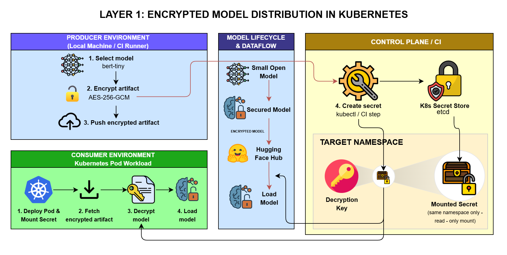

# Confidential ML Model Distribution PoC

Proof-of-concept for a confidential LLM model delivery pipeline: a
**Producer** encrypts a model and publishes it to Hugging Face Hub, and a
**Consumer** running in Kubernetes downloads, decrypts, and loads it -
never letting the plaintext model or the decryption key leave a trusted
boundary unnecessarily.

The project has three progressive layers, **all implemented**. Each layer
is optional and independent of the ones after it - you can run Layer 1
alone, Layer 1+2, or the full Layer 1+2+3 stack.

| Layer | Status | Adds |
|---|---|---|
| 1 - Encrypted distribution | **Implemented** | AES-256-GCM encryption, Hugging Face Hub as transport, key delivered via a Kubernetes Secret |
| 2 - Signing & verification | **Implemented** ([layer2/](layer2/)) | Producer signs the encrypted artifact with Ed25519; Consumer verifies against a Control-Plane-delivered public key before decrypting, aborting on failure |
| 3 - Attested key release | **Implemented** ([layer3/](layer3/)) | Kata + CoCo, Trustee KBS, and Confidential Data Hub replace the Secret with attestation-gated key release |

## Diagram (Layer 1)


## Architecture (Layer 1)

```
Producer                                Hugging Face Hub          Consumer (pod)
--------                                -----------------         ---------------
select_and_encrypt.py                                              (ServiceAccount: consumer-sa)
  download prajjwal1/bert-tiny
  tar -> AES-256-GCM encrypt
  writes: model.tar.enc,
          encryption.key, encryption.nonce
        |
push_artifact.py
  uploads model.tar.enc  ------------->  model.tar.enc
                                              |
                                              |  fetch_artifact.py
                                              v  downloads model.tar.enc
                                         (into consumer pod)

Control Plane / CI (scripts/create-secret.sh)
  reads encryption.key + encryption.nonce
  kubectl create secret model-decryption-key  ----->  mounted read-only at
                                                        /mnt/secrets in the pod
                                                              |
                                                              v
                                                        decrypt.py
                                                          AES-256-GCM decrypt
                                                          using mounted key/nonce
                                                              |
                                                              v
                                                        load_model.py
                                                          extract tar, load with
                                                          transformers, run smoke
                                                          test inference
```

See `docs/layer1-architecture.png` for a visual diagram.

## Architecture (Layer 2, optional)

```
Producer                     Hugging Face Hub       Consumer (pod)
--------                     -----------------      ---------------
generate_keys.py                                    fetch_artifact.py (unchanged)
  Ed25519 keypair                                      |
sign_artifact.py                                    verify_signature.py
  signs model.tar.enc         model.tar.enc.sig ---->  verifies against mounted
  uploads .sig  ------------------------------------>  public key
                                                         |  FAIL -> abort (exit non-zero)
Control Plane (create-configmap.sh)                     |  PASS -> continue
  publishes public key ------------------------------>  decrypt.py, load_model.py
  via ConfigMap (not a Secret -                          (unchanged)
  not secret data)
```

The public key is delivered via a Kubernetes ConfigMap from the Control
Plane, **not** published to Hugging Face Hub alongside the artifact - see
[layer2/README.md](layer2/README.md) for why that channel separation is
what makes verification meaningful.

Key points:

- The decryption **key and nonce never touch the Producer's cluster
  credentials** - Secret creation is a separate Control Plane/CI step
  (`scripts/create-secret.sh`), so the Producer image needs no RBAC
  permissions at all.
- The Consumer's Secret mount is read-only, scoped to a dedicated
  namespace (`confidential-ml-poc`) and ServiceAccount (`consumer-sa`),
  see `k8s/rbac-consumer.yaml`.
- AES-256-GCM is authenticated encryption: a corrupted or tampered
  ciphertext fails the GCM tag check in `decrypt.py` and aborts rather
  than silently returning garbage.

## Architecture (Layer 3, optional)

```
Producer/HF Hub          KBS (Trustee, dev/test)         Consumer (pod, kata-qemu-coco-dev)
----------------          ----------------------          -----------------------------------
(Layer 1+2, unchanged)                                    fetch_artifact.py, verify_signature.py
                                                             (unchanged)
                          default/key/my-model                   |
Control Plane/infra        {"key": "...", "nonce": "..."}        v
  01-install-coco-operator.sh    ^                          fetch_key_kbs.py
  02-deploy-kbs.sh                |                           GET 127.0.0.1:8006/cdh/resource/...
  03-fetch-kbs-client.sh          |                           (only reachable inside the
  04-set-resource.sh  ------------                             confidential VM)
  05-set-resource-policy.sh                <--- remote attestation --->
    (allow only when tee == "sample")       (kata-agent <-> KBS)
                                                                   |
                                                     FAIL -> abort, decrypt.py never runs
                                                     PASS -> decrypt.py, load_model.py (unchanged)
```

Replaces Layer 1's Kubernetes Secret with KBS-mediated, attestation-gated
key release: the consumer pod runs under the `kata-qemu-coco-dev`
RuntimeClass (a real QEMU/KVM micro-VM per pod) and only receives the
decryption key after remote attestation succeeds, instead of reading it
from a mounted Secret. Layer 2's signature verification is untouched and
still runs first. See [layer3/README.md](layer3/README.md) for the full
diagram, the version-pin notes, and required security disclaimers (this
uses a dev/test KBS and a deliberately permissive policy - PoC only, not
production-grade).

## Prerequisites

- Python 3.11+ (to run producer/consumer scripts locally, e.g. to test
  before containerizing)
- Docker, to build the producer and consumer images
- A container registry you can push to (e.g. Docker Hub, GHCR) and pull
  from inside your cluster
- `kubectl`, pointed at a running Kubernetes cluster (Docker Desktop's
  local cluster works fine for Layers 1-2 - **not** for Layer 3, see below)
- A Hugging Face account with a write-enabled access token, either via
  `huggingface-cli login` or the `HF_TOKEN` environment variable
- **Layer 3 only**: a real Linux host capable of running `kata-qemu-coco-dev`
  micro-VMs - bare-metal or a VM with nested virtualization enabled,
  Ubuntu 22.04+, Kubernetes 1.30+, containerd (not CRI-O). This does not
  work on Docker Desktop's built-in cluster or typical managed Kubernetes.
  See [layer3/README.md](layer3/README.md#environment-prerequisites) for
  full requirements and a preflight check script.

## Running it

### 1. Producer: encrypt and publish

Run locally (no cluster access needed - the producer never touches the
cluster):

```bash
cd producer
pip install -r requirements.txt
python src/select_and_encrypt.py --out-dir ../out
python src/push_artifact.py --repo-id <your-hf-username>/bert-tiny-encrypted --artifact-path ../out/model.tar.enc
```

This downloads `prajjwal1/bert-tiny`, encrypts it, and uploads
`model.tar.enc` to your Hugging Face Hub repo. `../out/encryption.key` and
`../out/encryption.nonce` stay local - do not commit or upload them.

Alternatively, build and run the producer as a container:

```bash
docker build -t confidential-ml-producer producer/
docker run --rm -v "$PWD/out:/out" -e HF_TOKEN confidential-ml-producer src/select_and_encrypt.py --out-dir /out
docker run --rm -v "$PWD/out:/out" -e HF_TOKEN confidential-ml-producer src/push_artifact.py --repo-id <your-hf-username>/bert-tiny-encrypted --artifact-path /out/model.tar.enc
```

### 2. Control Plane/CI: create cluster resources and the Secret

```bash
kubectl apply -f k8s/namespace.yaml
kubectl apply -f k8s/serviceaccount-consumer.yaml
kubectl apply -f k8s/rbac-consumer.yaml
./scripts/create-secret.sh out confidential-ml-poc model-decryption-key
```

### 3. Consumer: build and deploy

First, set `HF_REPO_ID` in `k8s/pod-consumer.yaml` to the repo you pushed
to in step 1 (e.g. `your-hf-username/bert-tiny-encrypted`).

#### Option A - local cluster only

e.g. Docker Desktop's built-in Kubernetes. No registry needed, *if* your
cluster's nodes share an image store with your local Docker Engine (this
isn't guaranteed - some Docker Desktop versions run Kubernetes nodes with
an isolated containerd, in which case you'll hit `ErrImageNeverPull` and
need Option B instead). To try it, edit `k8s/pod-consumer.yaml` and set:

```yaml
image: confidential-ml-consumer:latest
imagePullPolicy: Never
```

then:

```bash
docker build -t confidential-ml-consumer:latest consumer/
kubectl apply -f k8s/pod-consumer.yaml
kubectl logs -f consumer -n confidential-ml-poc
```

#### Option B - remote/real cluster (default in this repo)

`k8s/pod-consumer.yaml` ships with
`image: <your-registry>/confidential-ml-consumer:latest` and
`imagePullPolicy: IfNotPresent`. Replace `<your-registry>` with your
actual registry/username (e.g. your Docker Hub username), in both the
commands below and in the manifest's `image` field, then build and push:

```bash
docker build -t <your-registry>/confidential-ml-consumer:latest consumer/
docker push <your-registry>/confidential-ml-consumer:latest
kubectl apply -f k8s/pod-consumer.yaml
kubectl logs -f consumer -n confidential-ml-poc
```

You can also run the three consumer scripts locally (outside the cluster)
against the local `out/encryption.key` / `out/encryption.nonce` from step
1, to sanity-check the pipeline before containerizing/deploying:

```bash
cd consumer
pip install -r requirements.txt
python src/fetch_artifact.py --repo-id <your-hf-username>/bert-tiny-encrypted --out-dir ../out
python src/decrypt.py --artifact-path ../out/model.tar.enc --key-path ../out/encryption.key --nonce-path ../out/encryption.nonce --out-path ../out/model.tar
python src/load_model.py --tar-path ../out/model.tar --extract-dir ../out/model
```

### 4. Layer 2 (optional): sign, publish the verification key, and verify

Run after step 1 (producer) and before/alongside step 3 (consumer). Full
commands are in [layer2/README.md](layer2/README.md); summary:

```bash
# Producer: generate keys and sign the artifact from step 1
python layer2/producer/src/generate_keys.py --out-dir out
python layer2/producer/src/sign_artifact.py --repo-id <your-hf-username>/bert-tiny-encrypted --out-dir out

# Control Plane: publish the public key (parallel to create-secret.sh)
./scripts/create-configmap.sh out confidential-ml-poc model-verification-key

# Consumer image: layer the Layer 2 scripts on top of the Layer 1 image
docker build -t confidential-ml-consumer:latest consumer/
docker build -t confidential-ml-consumer:latest layer2/consumer/
```

`k8s/pod-consumer.yaml` already runs `verify_signature.py` between
`fetch_artifact.py` and `decrypt.py`, and mounts the verification-key
ConfigMap - no further manifest changes needed once the above is applied.

### 5. Layer 3 (optional): attested key release via CoCo + KBS

Requires a real Linux host - see [Prerequisites](#prerequisites) and
[layer3/README.md](layer3/README.md#environment-prerequisites). Full
commands are in [layer3/README.md](layer3/README.md); summary:

```bash
# Cluster/infra setup (once per cluster)
./layer3/infra/00-preflight-check.sh
./layer3/infra/01-install-coco-operator.sh
./layer3/infra/02-deploy-kbs.sh
./layer3/infra/03-fetch-kbs-client.sh

# Control Plane: load the decryption key + policy into KBS
./layer3/infra/04-set-resource.sh
./layer3/infra/05-set-resource-policy.sh

# Consumer image: layer the Layer 3 scripts on top of the Layer 1+2 image
docker build -t confidential-ml-consumer:latest layer3/consumer/
```

Edit `layer3/k8s/pod-consumer.yaml` (registry, `HF_REPO_ID`, and
`KBS_HOST`/`KBS_PORT` from `out/kbs-endpoint.env`), then
`kubectl apply -f layer3/k8s/pod-consumer.yaml` in place of the Layer 1/2
pod manifest - it runs under the `kata-qemu-coco-dev` RuntimeClass and
fetches the key from KBS instead of a mounted Secret.

## Verifying each layer works

### Layer 1 (implemented)

- **Secret exists and is scoped correctly:**
  `kubectl get secret model-decryption-key -n confidential-ml-poc` should
  show `Data: encryption.key, encryption.nonce`; confirm only `consumer-sa`
  can read it via `kubectl auth can-i get secret/model-decryption-key --as=system:serviceaccount:confidential-ml-poc:consumer-sa -n confidential-ml-poc`
  (expect `yes`) versus the `default` ServiceAccount (expect `no`).
- **End-to-end pipeline succeeded:** `kubectl logs consumer -n confidential-ml-poc`
  ends with a line like `Inference OK. last_hidden_state shape: (1, N, 128)`
  - this only happens if the artifact was fetched, decrypted, extracted,
    and loaded successfully.
- **Authenticated encryption actually protects the artifact:** corrupt a
  byte of `out/model.tar.enc` or point `decrypt.py` at the wrong key and
  re-run it - it should raise `cryptography.exceptions.InvalidTag` and
  exit non-zero rather than producing corrupted model output.

### Layer 2 (implemented)

- **Verification key exists and is scoped correctly:**
  `kubectl get configmap model-verification-key -n confidential-ml-poc`
  should show `Data: producer_ed25519.pub`. Unlike the decryption-key
  Secret, this doesn't need an RBAC read-restriction check - the public
  key isn't secret.
- **End-to-end pipeline succeeded:** `kubectl logs consumer -n confidential-ml-poc`
  should include `Signature verification OK. Proceeding to decrypt.py.`
  before the decrypt/load lines - this only happens if `verify_signature.py`
  found a valid signature.
- **Tampering is actually caught, and decrypt.py never runs:** run
  `./layer2/scripts/demo-tamper.sh <your-hf-username>/bert-tiny-encrypted`
  (or corrupt `model.tar.enc` / `model.tar.enc.sig` by hand and re-run
  `verify_signature.py`) - it should print
  `SIGNATURE VERIFICATION FAILED` and exit non-zero, and `decrypt.py`
  should not execute. See [layer2/README.md](layer2/README.md) for the
  full walkthrough.

### Layer 3 (implemented)

- **KBS resource and policy are set:** after
  `./layer3/infra/04-set-resource.sh` and `./layer3/infra/05-set-resource-policy.sh`,
  the resource exists at `default/key/my-model` (no direct `kbs-client get`
  path for humans by design - only attested pods can read it).
- **End-to-end pipeline succeeded:** `kubectl logs consumer -n confidential-ml-poc`
  should include `Key material released and written to '/tmp/kbs-key'.`
  before the decrypt/load lines - this only happens if remote attestation
  succeeded and the resource policy allowed release.
- **Policy denial is actually caught, and decrypt.py never runs:** run
  `./layer3/scripts/demo-policy-deny.sh` - it temporarily pushes a
  deny-all policy, redeploys the pod, and confirms the logs show
  `KEY RELEASE FAILED` with a non-zero container exit code, then restores
  the working policy. See [layer3/README.md](layer3/README.md) for the
  full walkthrough and required security disclaimers.

## Scale note

This PoC buffers the entire model artifact in memory for a single
`encrypt()`/`decrypt()` call, which is fine at `bert-tiny` size. A
production-scale model would need **chunked/streaming AEAD** instead -
encrypting/decrypting fixed-size frames with per-frame nonces derived from
a base nonce, so the whole model never has to fit in memory at once.

## Repo structure

```
.
├── producer/    Layer 1: select model, encrypt, push to HF Hub
├── consumer/    Layer 1: fetch, decrypt, load + smoke-test inference
├── layer2/      Layer 2 (optional, implemented): sign artifact, verify before decrypt
├── k8s/         Namespace, ServiceAccount, RBAC, Secret + ConfigMap templates, Pod spec
├── scripts/     Control Plane/CI steps: create-secret.sh, create-configmap.sh
├── diagrams/    Architecture diagram
└── layer3/      Layer 3 (optional, implemented): attested key release via
                 Kata + CoCo + Trustee KBS - infra/, consumer/, k8s/, scripts/
```
